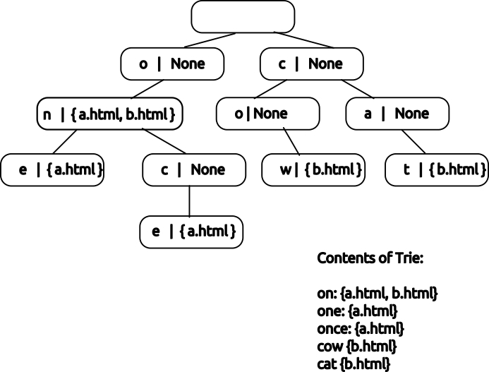

[](https://classroom.github.com/a/xu0_StUQ)
# Search Trie Project

For this project you will be crawling web pages, storing the resulting text in a special data structure known as a **trie** and using it to implement a search interface.

- Part 0: Write a helper function and some basic tests.
- Part 1: Write a `Trie` data type for use in search.
- Part 2: Implement a web crawler, which will populate your `Trie`.
- Part 3: Implement a search interface, using a library of your choosing.

A trie is a special type of search tree that efficiently represents string keys with common prefixes.

Your trie will associate words found on pages with the URLs they were found on:



(This image shows the keys as letters as shorthand, in practice your Trie will store keys using integer array positions.)

## Part 0 - `character_to_key`

Our `Trie` will require us to convert individual characters into numeric keys.

We'll use the following rules for our purposes:

- Keys will be treated as if they are made of lower case characters and `_`.
- Characters correspond to the numeric values 0-26, with 'a' = 0, 'z' = 25, and '_' = 26.
- A-Z will be treated as 0-25, identical to their lower case form.
- Any other character (such as a number or punctuation) will correspond to 26/'_'.

Tip: There are many ways to implement this, but you may consider the [`ord`](https://docs.python.org/3.11/library/functions.html#ord) function which can convert characters to integer representations.

**To earn full credit for this part you must:**

a) Complete the function `character_to_key` in `trie.py`.

b) Write at least four tests covering its behavior in `test_character_to_key.py`. Consider the cases above and make sure that you are adequately covering each of them.

Run your tests via `uv run pytest trie_search/test_character_to_key.py`

## Part 1 - Trie

You will implement a class `Trie` that will associate strings with values.

`Trie` must:

- be a `abc.MutableMapping`, which requires:
    - `__getitem__`
    - `__setitem__`
    - `__delitem__`
    - `__iter__`
    - `__len__`
- implement a method `wildcard_search(s: str) -> Iterable[tuple[str, Any]]` that allows fuzzy searching for strings.

**Note:** This type-hinting indicates that the return type is an iterable.  Both `wildcard_search` and `__iter__` will return this type.
You may return a generator (by using use `yield`) or implement any type, so long as it is iterable.
The elements of the iterable should be `tuple[str, Any]` which means a tuple with two elements, where the first is a string and the second is any type at all. (Key-Value pairs.)

The exact specification for each of these methods is given in `trie.py`.

Implement these methods and any other methods, classes, and/or functions needed for your implementation in `trie.py`.

### Tips

- You will want to implement a class to store individual nodes in the Trie.
- You may implement as many helper methods & functions as you see fit.
- It may be helpful to add `__repr__` methods, but we will not prescribe their format.

Run your tests via `uv run pytest trie_search/test_trie.py`

## Part 2 - Web Crawler

For the second part of this assignment, you will build a web crawler that gathers all of the words on a website and uses your `Trie` to make them searchable.

You are given a file with helper functions `utils.py`, and will write your solution in `crawler.py`.

### `utils.py`

You should not modify this file, it contains:

`ALLOWED_DOMAINS` - To ensure that your crawler doesn't visit sites outside the scope of this assignment we are restricting the domains it can visit. This is a tuple of strings of testing domains. Passing a domain that does not start with one of these to `fetch_html` will result in an error. You will need to filter the links you find using this tuple to avoid traversing to a forbidden page.

`fetch_html(html: str) -> str` - Fetches the raw HTML for a given website. The function will raise `FetchException` if an error is encountered (such as an invalid domain).

`get_links(html: str, source_url: str) -> list[str]` - Given a string of HTML, returns all URLs linked to from that page.

`get_words(html: str) -> text: str` - Given a string of HTML returns just the text on the page with no HTML tags left in.

### `crawler.py`

You will implement the following two functions within `crawler.py`:

### `crawl_site(start_url: str, max_depth: int) -> dict[str, list[str]]`

This function takes a starting URL and a maximum depth, and will begin a crawl collecting the words that appear on each page.

If `max_depth` is 0, no links should be followed.
Links from the starting page are considered depth=1, and links from those pages would be depth=2, and so on. Your code should only crawl as deep as links of the specified `max_depth`.

If `max_depth=1` this would also crawl all links that appear on the starting page.

**Your code must avoid visiting the same page twice. It is possible, even common, for pages to link back to the page that you have already visited. Your code must take care to avoid this, or it is likely to get stuck in infinite loops.**

The return value is a mapping of URLs to the words that appeared on that page.

### `build_index(site_url: str, max_depth: int) -> Trie`

`build_index` will use the words gathered by `crawl_site` to build a search index.

It should return a `Trie` where the keys are words seen on the crawl, and the value associated with each key is a set of URLs that word
appeared on.

### Example

Imagine a site with three very simple pages:

```html
<!-- index.html -->
<html>
  <a href="one.html">one</a>
  <a href="two.html">two</a>
  <p>this is the index page</p>
</html>
```

```html
<!-- one.html -->
<html>
  <a href="index.html">home</a>
  <p>page one | australia</p>
</html>
```

```html
<!-- two.html -->
<html>
  <a href="index.html">home</a>
  <p>page two | new zealand</p>
</html>
```

Your `Trie` would contain:

| word | urls |
|-|-|
| one | {index.html, one.html} |
| two | {index.html, two.html} |
| this | {index.html}
| is | {index.html}
| the | {index.html}
| index | {index.html}
| page | {index.html, one.html, two.html} |
| home | {one.html, two.html}
| australia | {one.html} |
| new | {two.html} |
| zealand | {two.html} |

### Tips

You can run these tests with `uv run pytest trie_search/test_crawler.py -x`

You should probably run these tests with `-x` so that if a test fails you do not continue.  It is probably easiest to get the tests running in the order provided.

You may also find `-k` useful, `-k example` for instance, will only run tests that include "example" in their name, which will avoid running the (slower/more complicated) parks tests until you are ready.  You can also specify a full test name, so `-k build_index_parks` will just run that final test.

Additionally, you will note that these tests make real web requests. They can be slow and in rare cases you may get a connection error unrelated to your code (if so try again).


## Part 3 - Search Interface

For this final portion of the assignment, you will build a small interface to your search index.

### Requirements

For this assignment you need to create an interface that achieves the following:

- When the program starts it should crawl the given URL, building a `Trie` using the methods defined in earlier parts.
- Once the crawl is complete, a search box should be available, prompting the user to enter text.
- Typing a query into the search box should execute a search against the `Trie`.
  - The results should be displayed in two columns: the word that matched followed by one entry per page.
  - If there are no results, a message stating so should be displayed.
- It should be possible to continue to search indefinitely.

Beyond these requirements, your implementation is up to you.

We won't have automated tests for this portion, instead we will run one of the commands below & use your application.

### Option A: Terminal Interface using Rich

You have seen the `rich` library used on prior assignments to build "TUI", terminal user-interfaces.

TUIs are a useful solution for small tools that can be used to automate common tasks or provide an interface to various libraries or APIs.

If you go this route:

- Be sure to `uv add rich` & check in the changes to `pyproject.toml` and `uv.lock`.
- Write your application in `trie_search/tui.py`, making it runnable via `uv run python -m trie_search.tui`.
- You may want to look at the code from the card game problem for guidance.

You will want to read the following pages to get started:

- <https://rich.readthedocs.io/en/stable/introduction.html>
- <https://rich.readthedocs.io/en/stable/prompt.html>
- <https://rich.readthedocs.io/en/stable/columns.html>
- <https://rich.readthedocs.io/en/stable/tables.html>

Also take advantage of the `rich` code that's already been shared on prior assignments (the card game in particular)
but be sure to turn in *your own code*.

### Option B: Web Interface using Flask

If you'd like to try something different, you may instead create a `Flask` application.

If you go this route:

- Be sure to `uv add flask` & check in the changes to `pyproject.toml` and `uv.lock`.
- Write your application in `trie_search/web.py`, making it runnable via `uv run flask --app trie_search.web run`.
- Your application should present the search interface on the "/" route, so navigating to `localhost:5000` will allow the interaction described in the requirements. (You may add any other routes you wish.)

You will want to read the following to get started:

- <https://flask.palletsprojects.com/en/stable/quickstart/#a-minimal-application>

Once you hit the section **File Uploads** you can stop, nothing below that section should be needed for this assignment.
